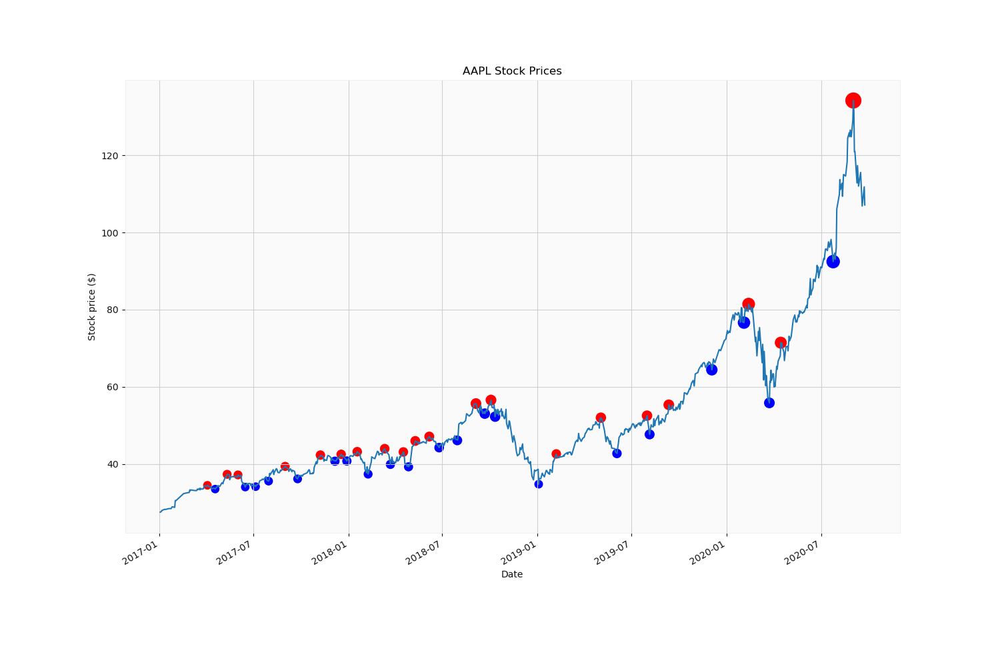

# TITLE: A Sample Project

```
Team Members: CPSC6300
Date: Dec 8, 2020
```

## Probelm Statement and Motivation
This should be a brief and self-contained decription of the problem that your project aims to solve and what motivated you to solve this problem.

This document illustrates how to write a report using Markdown ([markdown][]).

## Introduction and Description of Data

+ Description of relevant knowledge. 
+ Why is this problem important?
+ Why is it challenging? 
+ Introduce the motivations for the project question and how that question was defined through preliminary EDA.

## Literature Review/Related Work 
This could include noting any key papers, texts, or websites that you have used to develop your modeling approach, as well as what others have done on this problem in the past. You must properly credit sources.

Random forests are a combination of tree predictors such that each tree depends on the values of a random vector sampled independently and with the same distribution for all trees in the forest. see [random_forest][].

## Create a Website using Markdown

To create a website using Markdown for the cpsc4300/cpsc6300 class to view, you can use the following process:

1. Create a subfolder named with your username within the folder /zfs/courses/CPSC6300/web:

        mkdir -p /zfs/courses/CPSC6300/web/$USER

1. Check out your course project repository into the newly created folder:

        cd /zfs/courses/CPSC6300/web/$USER
        git clone {your-project-repo}
        cd {your-project-repo-dir}
        mkdir docs
        cp report/report.md docs/index.md

1. create a mkdocs.yml file

       ```
       site_name: CPSC6300 Course Project
         nav:
           - Home: index.md
       theme: readthedocs
       ```

1. Edite the file docs/index.md to include your report.

1. Build the website

        module load courses/cpsc6300
        mkdocs build

1. Open the URL http:{your-loginvm-ip}:8080/~{your-username}/{your-project-repo-dir}/site/ in a browser to check your website.
        For example, visit [this example site](http://10.128.97.93:8080/~xizhouf/course_project/site/).

1. Commit all your project files to github

        git status
        git add docs/index.md
        git add docs/figs/*
        git add {other-files}
        git commit -m 'finalize project'
        git push

1. Add your website URL to canvas [Project signup sheet](https://clemson.instructure.com/courses/118802/pages/project-url-signup)

## Create Website using voila
 
1. Create a web folder under one of the member of the project team
 
       cd /zfs/courses/CPSC6300/web/
       mkdir -p $USER

1. Check out your project from github

       cd /zfs/courses/CPSC6300/web/$USER
       git clone {your-project-repo}
       cd {your-project-repo-dir}

1. Start Voila service in a screen session

       screen
       module load courses/cpsc6300
       voila {your-project-jupyter-notebook} --no-browser --debug

1. Check your web service at http://{your-login-vm-ip}:8866/


## Modeling Approach

+ Describe the baseline model.
+ Describe your implementations beyond the baseline model and the design choices that you have made.

## Project Trajectory, Results, and Interpretation 

Briefly summarize any changes in your project goals or implementation plans you have made.
These changes are a natural part of any project, even those that seem the most straightforward at the beginning.
The story you tell about how you arrived at your results can powerfully illustrate your process. 


Next, show your results. How well does your model and/or implementation perform? Did you meet your goals?

### Example Results #1

Here is an example to include figures in your report.


<center>Fig 1. Apple Stock Peaks</center>

### Example Results #2

Here is an example to include tables in your report.

|	 | CountVectorizer	 | TfidfVectorizer |
| ------ | --------------------- | ---------------- |
| LogisticRegression	|  0.799863  |	0.785519  |
| NaiveBayes   |	0.766052	| 0.650273 |
| RandomForest | 	0.734631	| 0.734290 |


Finally, give some interpretation. What do your results mean? What impact will your work have?

## Conclusions and Future Work

Summarize your results, the strengths and short-comings of your results, and speculate on how you might address these short-comings if given more time.

## References:
`This could include the revised key papers, texts, or websites that you may use to develop your project.

[random_forest]: https://doi.org/10.1023/A:1010933404324 "Breiman, L. Random Forests. Machine Learning 45, 5–32 (2001)."
[markdown]: https://daringfireball.net/projects/markdown/syntax "Markdown Syntax"

1. [random_forest] Breiman, L. Random Forests. Machine Learning 45, 5–32 (2001). https://doi.org/10.1023/A:1010933404324
1. [markdown] John Gruber. Markdown Syntax, https://daringfireball.net/projects/markdown/syntax


## Support Materials
Provide a list of materials that support your project, for example, the notebooks and data sources.

## Declaration of academic integrity and responsibility

In your report, you should include a declaration of academic integrity as follows:

```
With my signature, I certify on my honor that:

The submitted work is my and my teammates' original work and not copied from the work of someone else.
Each use of existing work of others in the submitted is cited with proper reference.
Signature: ____________ Date: ______________
```

## Credit
The above project template is based on a template developed by Harvard IACS CS109 staff (see https://github.com/Harvard-IACS/2019-CS109A/tree/master/content/projects).
